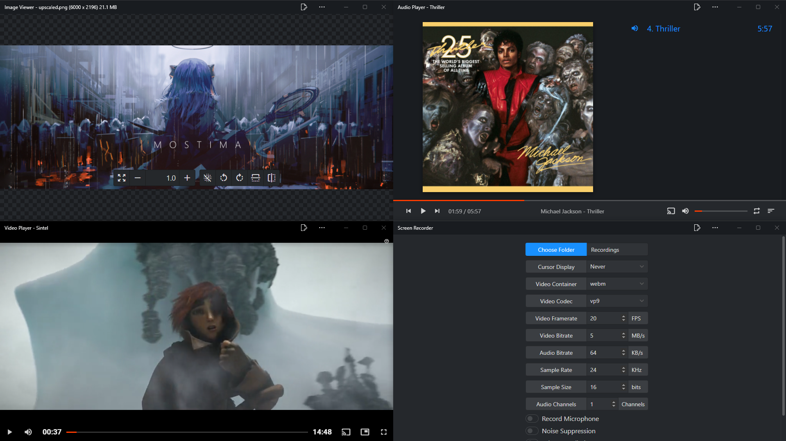

# PWA Haven

Make sure to enable `chrome://flags#file-handling-api` if you want to be able to set the apps as defaults for extensions.

## What is this?
Haven is a collection of small, fast, simple and powerful Progressive Web Apps which aim to replace native OS apps. This includes:
- Video Player
- Image Viewer
- Audio Player
- Torrent Client
- Screen Recorder
- and more to come!

## What's the point of this?
The main goal is to replace oversized native apps, with simple, lightweight browser based apps, which don't create copies of processes, but instead share one environment, which likely was already in-use by the user, for example browsing the web or reading articles, eliminating those duplicate processes. Additionally they don't create any new background processes or services when not in use.

## What are the features?
You can see the list of features [here!](docs/features.md)

## Why are the names so generic?
Because these are generic apps, they are essentially no different in functionality from their native counterparts [even if what they accomplish is unique for the web, but not for native apps], which also means they have no compromises from their decent native counterparts, and bring nothing new to the table, outside of their VERY low resource usage and load times.

## Will I notice any difference from native apps?
You shouldn't. The apps work fully offline, auto-update instantly and benefit from all the other goodies native apps have. The only feature they lack is the prompt to open a folder&/multiple files at once, however the user can just drag-drop the folder/files into the app instead.

## What browsers are supported?
Even tho the target is chromium, all browsers should work, some however with compromises, ex: Brave and mobile chromium can't handle native files but when there are no active files, interacting with any app will prompt a file selection menu, Firefox can't install as PWA and has worse performance in the video player and doesn't support cast, safari hopefully won't work at all, etc. So while all apps should work on all browsers [except safari], some might loose features, the apps are however designed in a way as for that to not cause any issues during usage. 

## Are these secure?
Yes, very. They are as secure as any other website, and all permission requests are always propmpted to the user. They don't have access to any native folders, unless the user explcitly grants that permission for that specific folder, with exceptions to any sort of root directory, to which the app can never get permissions for.

## Why did you make this?
Practice coding, cool new API to play with, look at potential future of PWA's, because default Win10 apps are a fucking piece of slow, bloated garbage which can't even do it's job right.
