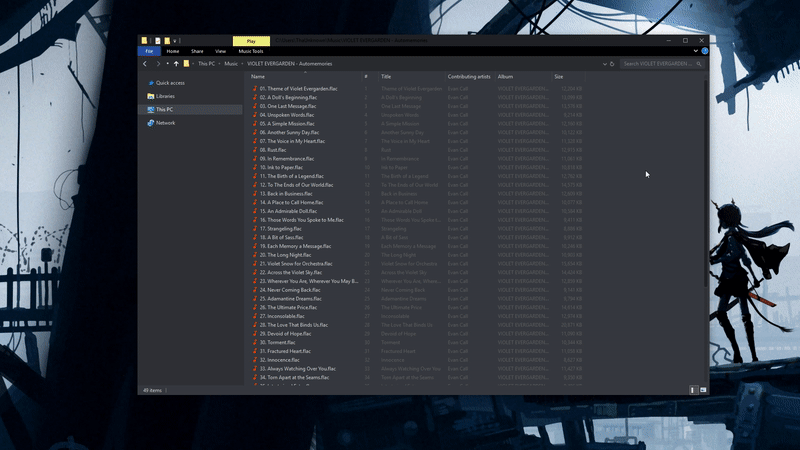

# **Shared**
These resources are shared between all apps, no matter how many instances of the apps you run, this will only be used once:

Shared filesize <500KB

RAM usage <30MB

These features are shared between all PWA's:
- Single, shared update controller
- Instant updating
- Fully offline capable
- Very Lightweight
- Support for multiple concurrent files
- Support for URL search parameters `[treats any parameter as file URL, ex: ?foo=file.png&bar=file2.png]`
- Support for files, folders*, URLs, URIs and XML
  - Clipboard support 
  - Drag & Drop support
  - Native File Handling `[chrome://flags/#file-handling-api]`

*You can paste/dragdrop entire folders of files and the apps will detect them without issue, this however doesn't support recursive folders.

# **Image Viewer**
Filesize <25KB

RAM usage <30MB per instance
- Support for a lot of formats `[apng, avif, bmp, gif, jpg, jpeg, png, svg, tiff, webp, ico and others]`
- Transforms: zoom, rotate, flip, mirror
- Anti-aliasing toggle for pixelart
- Quickly switch between multiple images
- Persistent transforms `[allows to compare images of different resolutions and proportions, staying at the same relative position]`

# **Audio Player**
Filesize <350KB

RAM usage <40MB per instance
- Support for a lot of formats `[3gpp, 3g2, acc, ac3*, amr, eac3*, flac, mp3, mp4, mpeg, ogg, opus, raw, wav, weba and others]`
- Support for a lot of metadata tags `[ape, asf, exif, id3, riff/info]`
- Support for external cover files
- Basic playback controls `[play, pause, last, next, progress, volume, mute, loop one, shuffle, cast, playback speed]`
- Keybinds `[space, n, m, c, leftarr, rightarr, uparr, downarr, [, ], \]` [view all keybinds with `]
- Screenshot current frame `[with subtitles, default bind: X]`
- Media Session support, with audio metadata
- Media Controls support, with audio metadata
- Popout visualizer
- Cast support
  - Metadata tag support `[displays custom image and author]`
  - Real-time transcoding `[very high quality, hardware accelerated]`

*Only on new Edge.

# **Video Player**
Filesize <3.2MB

RAM usage <70MB per instance `[note: this can sometimes exceed 0.5GB based on the video which is being played because of video caching]`
- Support for a lot of video formats `[3gpp, 3g2, m4v, mp4, qt, ogg, webm, m2ts*, mkv and others]`
- Support for the most popular video codecs `[av1, h.264, h.265*, theora, vp8, vp9 and others]`
- Subtitle support `[srt, vtt, ass, ssa, sub, txt]`
  - External subtitles `[external files]`
  - Softcoded/embedded subtitles, fonts and glyphs `[for URLs/remote playback, the media must be CORS enabled]`
- Basic playback controls `[play, pause, last, next, progress, volume, mute, cast, pip, fullscreen]`
- Keybinds `[space, n, m, p, f, s c, leftarr, rightarr, uparr, downarr]`
- Multi-sub support
- Multi-audio support `[Requires about://flags/#enable-experimental-web-platform-features to be enabled]`
- Multi-video support `[Requires about://flags/#enable-experimental-web-platform-features to be enabled]`
- Seek preview thumbnails
- Media Session support `[metadata based on parsed file name]`
- Media Controls support
- Picture In Picture
  - Real-time subtitle burn-in `[lossless, hardware accelerated]`
- Cast support
  - Real-time transcoding `[high quality, hardware accelerated]`
  - Real-time subtitle burn-in `[very high quality, hardware accelerated]`
- Stats for nerds
  
*Only on new Edge.

# **Screen Recorder**
Filesize <45KB

RAM usage <300MB per instance `[35MB when idle]`
- Saves directly to drive `[chromium only]`
- Very wide range of settings `[container, coded, framerate, bit rates, sample rates, sample sizes, audio channels, system audio recording, microphone recording, noise supression, echo cancellation]`
- Very lightweight `[hardware accelerated]`

# **Torrent Client**
Filesize <1.1MB

RAM usage 100MB-300MB+ `[this can vary greatly based on the amt of active torrents, and network connections]`
- WebRTC only
- Saves directly to drive `[chromium only]`
- Progress carries over sessions
- Simple UI
  - Single UI for adding and creating torrents
  - Torrent stats UI
  - Peer list UI
  - Full torrent controls, pause, resume, remove, delete, copy manet, save .torrent
  - Speed limiting

For full list of BEP support see [this.](https://github.com/webtorrent/webtorrent/blob/master/docs/bep_support.md)
